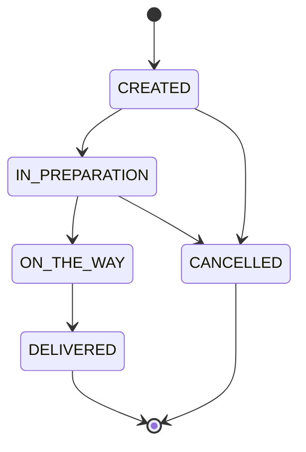

# Guía de pruebas con Postman y flujos de la aplicación

Esta guía explica cómo levantar Pizzeria Lite, importar y usar la colección de
Postman, y describe en detalle los flujos de negocio de los módulos Producto
y Pedido tal como quedaron después de la refactorización (rama
`feature/refactoring`).

## 1. Prerrequisitos

- Docker y Docker Compose (para la base de datos PostgreSQL).
- Java 17 (o el JDK configurado en tu entorno) y el wrapper de Gradle
  (`./gradlew`) incluido en el proyecto.
- Postman (o cualquier cliente HTTP compatible con colecciones v2.1).
- Un archivo `.env` en la raíz del proyecto con, al menos, estas variables
  (ver `.env` de ejemplo del repo):

  ```
  APPLICATION_NAME=pizzeria-lite
  DB=pizzeria_db
  USER=pizzeria_user
  PASS=pizzeria_pass123
  API_URL=https://api.fake-sms-provider.com/v1/send
  API_KEY=sk_test_...
  SPRING_PROFILES_ACTIVE=dev
  ACTUATOR_USER=admin
  ACTUATOR_PASSWORD=changeme
  ```

## 2. Levantar el entorno

```bash
docker compose up -d db
./gradlew bootRun
```

Con el perfil `dev` activo (el default si no seteás `SPRING_PROFILES_ACTIVE`),
Hibernate actualiza el esquema automáticamente y `data.sql` carga datos de
ejemplo: 9 productos y 3 pedidos ya existentes. La API queda disponible en
`http://localhost:8080`.

## 3. Importar la colección de Postman

1. Abrí Postman → **Import** → seleccioná
   `postman/pizzeria-lite.postman_collection.json`.
2. La colección trae una variable `base_url` ya configurada en
   `http://localhost:8080`. Si tu app corre en otro puerto, editá esa
   variable en la pestaña **Variables** de la colección.
3. La colección está organizada en tres carpetas: **Products**, **Orders** y
   **Actuator**.

> Nota: algunas requests de la colección fueron pensadas para la versión
> intencionalmente vulnerable del laboratorio (por ejemplo, "Search products
> by name (SQL injection demo)" o el acceso libre a `/actuator/env`). En esta
> rama refactorizada esos endpoints ya están corregidos — más abajo se explica
> qué comportamiento esperar ahora en cada caso.

## 4. Arquitectura y flujo general

Cada módulo (`product`, `order`) sigue ahora el mismo camino de una petición:

```
Controller (valida forma del request con @Valid)
   -> Service (reglas de negocio, entidades, excepciones de dominio)
      -> Repository (acceso a datos)
```

Los controladores ya no devuelven entidades JPA ni acceden a repositorios
directamente: reciben/devuelven DTOs (`ProductRequest`/`ProductResponse`,
`OrderRequest`/`OrderResponse`, etc.) y delegan toda la lógica a los
servicios. Cualquier excepción de negocio (`ProductNotFoundException`,
`OrderNotFoundException`, `InvalidOrderStatusTransitionException`,
`BusinessValidationException`) es capturada por un `GlobalExceptionHandler`
central que devuelve siempre el mismo formato de error:

```json
{
  "timestamp": "2026-08-27T10:15:30",
  "status": 404,
  "error": "Not Found",
  "message": "Product not found: 999",
  "path": "/api/products/999",
  "details": []
}
```

Cuando el error es de validación de campos (`@Valid` sobre el DTO), `details`
trae la lista de mensajes por campo, por ejemplo:

```json
{
  "status": 400,
  "error": "Bad Request",
  "message": "Validation failed",
  "details": ["Product name is required", "Product price must be greater than zero"]
}
```

## 5. Flujo de negocio: Producto

### Crear un producto — `POST /api/products`

1. El body se valida con Bean Validation (`ProductRequest`): `name` no vacío,
   `category` no nula, `price` no nulo y positivo.
2. Si pasa la validación de forma, `ProductService.create` valida la regla de
   negocio propiamente dicha: el precio no puede superar `product.max-price`
   (500, configurable en `application.yml`) — si la supera, se responde `400`
   con `BusinessValidationException`.
3. Si todo es válido, se guarda el producto y se responde `201 Created` con el
   `ProductResponse`.

**Probar en Postman:** carpeta *Products* → *Create product*. Probá también
casos de error editando el body: `name` vacío, `price` negativo o `price` en
9999 (dispara la regla de negocio, no la de validación de forma).

### Buscar productos — `GET /api/products/search?name=...`

Antes concatenaba el parámetro directo en SQL (inyección SQL). Ahora usa una
Query Method de Spring Data (`findByNameContainingIgnoreCase`), parametrizada
por JPA. Podés probar `name=' OR '1'='1` desde la request *"Search products by
name (SQL injection demo)"*: ya no devuelve todos los productos, sino una
lista vacía, porque el texto se trata como literal de búsqueda y no como
código SQL.

### Actualizar / cambiar disponibilidad / eliminar

- `PUT /api/products/{id}` — reemplaza los campos del producto (misma
  validación que la creación).
- `PATCH /api/products/{id}/availability?available=false` — sólo cambia el
  flag `available`.
- `DELETE /api/products/{id}` — responde `404` si el id no existe (antes de
  intentar borrar), `204 No Content` si se eliminó.

## 6. Flujo de negocio: Pedido

### Crear un pedido — `POST /api/orders`

Usá la request *Create order* de la colección, que ya trae este body:

```json
{
  "customerName": "Ana Torres",
  "customerPhone": "+51999888777",
  "customerAddress": "Av. Central 100, Lima",
  "couponCode": "PIZZA10",
  "items": [
    { "productId": 2, "quantity": 2 },
    { "productId": 5, "quantity": 3 }
  ]
}
```

Paso a paso de lo que hace `OrderService.create`:

1. `@Valid` sobre `OrderRequest` exige `customerName` no vacío y `items` no
   vacío; cada `OrderItemRequest` exige `productId` no nulo y `quantity`
   positiva.
2. Por cada ítem, `OrderService` pide el producto a `ProductService.findById`
   (ya no accede al repositorio de Producto directamente):
   - Si el producto no existe → `404 Product not found: <id>`.
   - Si existe pero `available=false` → `400 Product not available: <nombre>`.
   - Si es válido, "congela" `productName` y `unitPrice` en el `OrderItem` y
     calcula su `lineTotal`.
3. `PricingService.calculate` computa el descuento sobre el subtotal, con
   reglas acumulables (configurables en `application.yml`, sección
   `pricing`):
   - Cupón `PIZZA10` → 10% sobre el subtotal.
   - Subtotal > 100 → +10%; si no, subtotal > 50 → +5%.
   - Cantidad total de unidades ≥ 5 → +5% adicional.
4. Se guarda el pedido en estado `CREATED` y se dispara
   `NotificationService.sendOrderStatusNotification` (queda registrado en el
   log de la aplicación, sin loguear ninguna credencial).

**Cálculo esperado para el ejemplo de la colección:**
- Ítems: 2× Pepperoni Pizza (10.99) + 3× Coca-Cola (2.50) → subtotal = 21.98 + 7.50 = **29.48**
- Cantidad total = 5 → aplica el descuento por cantidad (5%)
- Cupón `PIZZA10` → 10% adicional
- Descuento = 29.48 × 0.10 + 29.48 × 0.05 = 2.948 + 1.474 ≈ **4.42**
- Total = 29.48 − 4.42 = **25.06**

Verificá que la respuesta (`subtotal`, `discountAmount`, `total`) coincida con
estos valores.

### Cambiar el estado de un pedido — `PUT /api/orders/{id}/status`

La máquina de estados vive en `OrderStatusTransitionValidator`:



**Probar en Postman:**
- Camino feliz: *Update order status* contra el pedido #3 (`CREATED`) con
  `{"status": "IN_PREPARATION"}` → `200 OK`.
- Transición inválida: repetí la misma request pero con
  `{"status": "DELIVERED"}` (saltea `IN_PREPARATION` y `ON_THE_WAY`) →
  `400 Bad Request`, `"Cannot move order from CREATED to DELIVERED"`.
- Estado inexistente: `{"status": "SHIPPED"}` → `400`,
  `"Unknown status: SHIPPED"`.
- Estado final: intentá cambiar el pedido #1 (`DELIVERED`, dato de ejemplo) a
  cualquier otro estado → siempre `400`, porque `DELIVERED` no tiene
  transiciones permitidas.

### Buscar pedidos por cliente y eliminar

- `GET /api/orders/search?customerName=...` — igual que en Producto, ahora es
  una Query Method parametrizada (`findByCustomerNameContainingIgnoreCase`),
  ya no vulnerable a inyección SQL.
- `DELETE /api/orders/{id}` — borra primero los `OrderItem` asociados y luego
  el pedido; `404` si el id no existe.

## 7. Actuator y seguridad

La exposición de Actuator quedó restringida a `health`, `info` y `metrics`
(antes era `"*"`, todo expuesto). Además, sólo `health` e `info` son públicos;
el resto requiere autenticación HTTP Basic con las credenciales de
`ACTUATOR_USER` / `ACTUATOR_PASSWORD` (`admin` / `changeme` por defecto).

**Probar en Postman:**
- *Health* → sigue respondiendo `200` sin autenticación.
- *Env* y *Beans* → ahora responden `404`, porque esos endpoints ya no están
  en la lista de exposición (nunca llegan a evaluar la autenticación).
- Para probar un endpoint protegido, creá una nueva request a
  `{{base_url}}/actuator/metrics`:
  - Sin credenciales → `401 Unauthorized`.
  - Con **Basic Auth** (pestaña *Authorization* de Postman) usando
    `admin` / `changeme` → `200 OK`.

## 8. Resumen de códigos de respuesta

| Código | Cuándo ocurre |
|---|---|
| 200 | Lectura u operación exitosa (`GET`, `PUT`, `PATCH`) |
| 201 | Creación exitosa (`POST /api/products`, `POST /api/orders`) |
| 204 | Eliminación exitosa (`DELETE`) |
| 400 | Validación de campos (`@Valid`) o regla de negocio incumplida (precio máximo, producto no disponible, transición de estado inválida, estado desconocido) |
| 401 | Falta autenticación en un endpoint de Actuator protegido |
| 404 | Recurso inexistente (producto o pedido) o endpoint de Actuator no expuesto |
| 500 | Error inesperado no mapeado a una excepción de dominio (queda registrado en el log del servidor, sin exponer detalles internos en la respuesta) |
